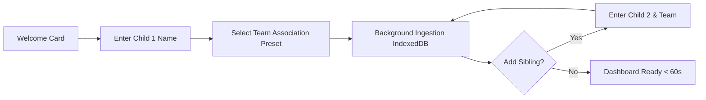
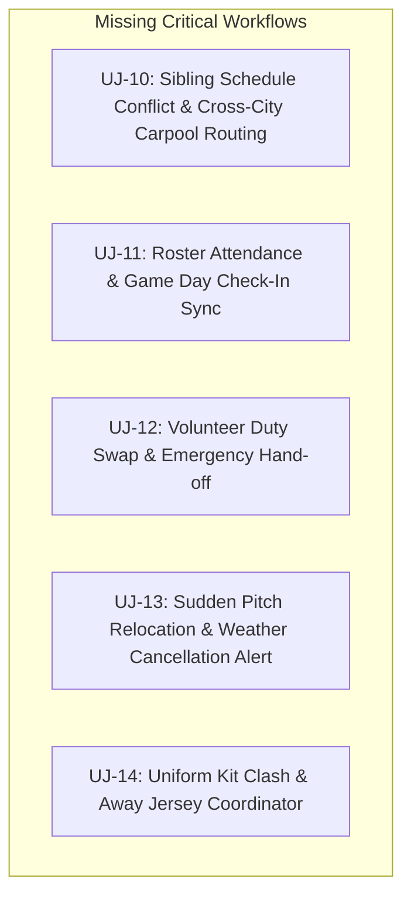

# Pelipäivä (Matchday Hub) — Staff PM & Principal UI/UX Review

**Author:** Staff Product Manager & Principal UI/UX Designer (Mobile Consumer & Family Logistics)  
**Date:** August 2026  
**Subject:** Deep Evaluation of `docs/USER_JOURNEYS.md` (UJ-01 through UJ-09)  
**Target Market:** Nordic Youth Sports Ecosystem (Finland / Sweden / Norway)

---

## Executive Summary

Pelipäivä targets one of the most emotionally exhausting, logistically complex, and high-frequency routines in modern Nordic family life: **youth sports logistics**. 

The current specification (`docs/USER_JOURNEYS.md`) outlines 9 foundational journeys spanning onboarding, matchday morning execution, weather inspection, venue navigation, WhatsApp import, zero-auth family syncing, volunteer duty tracking, tournament weekends, and offline resilience.

### Strategic Verdict
* **Product-Market Fit Score: 8.8 / 10** — The core value proposition hits the exact pressure points of Finnish sports parents (Palloliitto/Tulospalvelu fragmentation, WhatsApp schedule chaos, strict parking traps, talkoo obligations, and kuplahalli connectivity dead zones).
* **UX Delight & Sovereignty Score: 9.0 / 10** — The zero-auth, offline-first, client-side NLP ethos eliminates massive barriers to entry compared to legacy enterprise platforms (MyClub, Nimenhuuto, Jopox).
* **Critical Friction & Blind Spots: 6.5 / 10** — The journeys currently assume single-child linear flows, optimistic parsing without failure recovery, and underplay multi-child concurrent schedule collisions, duty swaps, and complex multi-pitch navigation (e.g. finding "Bollis 6" in a 10-pitch complex).

---

## Part 1: Strategic Assessment & Nordic Market Fit

### 1.1 The Reality of Nordic Youth Sports Logistics
In Finland and the Nordics, junior sports (football, floorball, ice hockey, basketball) operate in a uniquely fragmented environment:
1. **Platform Sprawl:** Official fixtures live in association systems (Palloliitto/Taso/Tulospalvelu, Salibandyliitto/Torneopal, Leijonat/Tilastopalvelu), team rosters and fees live in club management tools (MyClub, Jopox, Nimenhuuto), while real-time tactical changes and coach instructions happen in unindexed **WhatsApp group chats**.
2. **Extreme Weather & Pitch Surfaces:** Parents must navigate transitions between natural grass (*nurmi*), 3G/4G artificial turf (*tekonurmi*), indoor sports halls (*parketti/matto*), and pressurized air domes (*kuplahalli/ylipainehalli*). Inappropriate footwear (e.g. wearing FG cleats on hard futsal floors or AG studs on wet turf) leads to injury or ruined equipment.
3. **The "Talkoo" Social Contract:** Volunteer kiosk shifts (*kahviovuoro*), scorekeeping (*toimitsijavuoro/kirjuri*), and field maintenance (*kenttävuoro*) are non-negotiable community duties. Forgetting a shift creates severe social friction in parent communities.
4. **Municipal Parking Traps:** Overcrowded urban sporting hubs (e.g. Bollis, Käpylä, Tali, Matinkylä, Leppävaara) are primary hunting grounds for municipal parking wardens enforcing strict parking disc (*pysäköintikiekko*) regulations and obscure time limits.

### 1.2 Evaluation of the 9 User Journeys Against Market Realities

| Journey | Real-World Frequency | Emotional Stakes | Nordic Relevance | PM Fit Assessment |
| :--- | :--- | :--- | :--- | :--- |
| **UJ-01: Onboarding & Multi-Child Roster** | 1–2x / season | Low (High drop-off risk) | High (Multi-sport families) | **Strong.** Zero-auth bypasses the #1 friction point of competitor apps. |
| **UJ-02: Matchday Mission Control & HUD** | 2–4x / weekend | Very High (Panic, late departure) | Critical (Weather, surface, gear) | **World-Class Value.** The Time-To-Leave (TTL) and footwear gauge solve Saturday morning stress. |
| **UJ-03: Weather Radar & Storm Proximity** | 1–2x / weekend (Outdoor) | Medium-High (Safety & comfort) | High (Unpredictable Nordic climate) | **Strong.** Direct FMI radar embeds beat generic weather forecast apps. |
| **UJ-04: Venue & Parking Risk Assessment** | 2–4x / weekend | High (Financial risk: €60–€80 fines) | Critical (Strict Finnish parking laws) | **Unique Value Differentiator.** No other sports app addresses parking disc traps. |
| **UJ-05: Unstructured WhatsApp Import** | 1–3x / month | High (Tedious manual typing) | Critical (Coaches use WhatsApp for friendlies) | **Killer Feature.** Offline regex/NLP parsing directly solves coach-to-parent chaos. |
| **UJ-06: Zero-Auth Family Sync & Pairing** | 1x / family setup | Medium (Coordination friction) | Critical (Divorced/co-parents, grandparents) | **High UX Sovereignty.** 6-character code removes password sharing friction. |
| **UJ-07: Talkoovahti Volunteer Tracking** | 2–6x / season | Very High (Social embarrassment) | Critical (Nordic club talkoo culture) | **High Emotional Relief.** Prevents forgotten kiosk and scorekeeper shifts. |
| **UJ-08: Tournament Weekend Expedition** | 3–6x / year | Extreme (Logistical exhaustion) | Critical (Helsinki Cup, Masto Cup, etc.) | **High Value.** Dense multi-match grids with travel buffer warnings. |
| **UJ-09: Offline Matchday Resilience** | Continuous | High (Panic when disconnected) | Critical (Kuplahallit, basement shelters) | **Essential Foundation.** Prevents dead-screen failures inside reinforced venues. |

---

## Part 2: Detailed Journey Critique (Good vs. Bad / UX Heuristics)

---

### UJ-01: First-Time Onboarding & Multi-Child Roster Setup



#### What is GOOD (Delight Factors & Smart Patterns):
* **Zero-Auth Instant Gratification:** Bypassing email/password/SSO upfront adheres strictly to the *Progressive Disclosure* heuristic. The user experiences immediate utility before being asked for any administrative commitment.
* **Streamlined Multi-Child Flow:** The *"+ Tallenna ja lisää seuraava pelaaja"* loop accommodates multi-sport families naturally without forcing them into a complex settings hierarchy later.
* **Sub-60s Time to Value (TTV):** Direct connection to Palloliitto/association feeds delivers instant schedule population, creating an immediate "Aha!" moment.

#### What is BAD / RISKY / SUBOPTIMAL (Friction Points & Blind Spots):
* **Ambiguous Team Search & Selection:** Nordic club team naming is notoriously complex (e.g., *"HJK Töölö Sininen 1"*, *"HJK Töölö Sininen 2"*, *"HJK Kannelmäki Valkoinen"*). If the preset selector is imprecise or lacks division/coach metadata, parents will easily link the wrong squad.
* **Lack of Data Ingestion Preview:** The user taps *"Jatka"* and matches are fetched in the background. Without an immediate preview card showing *"Found 14 fixtures for Otso (PPJ)"*, the user feels uncertainty over whether the feed actually worked.
* **Multi-Team/Multi-Role Neglect:** Many junior players "loan" or double-roster for both an elite team and a challenge team (e.g., *Edustus* and *Haaste*), or play in two age categories. Single-team association per child is overly restrictive.

---

### UJ-02: Matchday Morning Mission Control & Departure HUD

#### What is GOOD (Delight Factors & Smart Patterns):
* **Time-to-Leave (TTL) Gauge as Hero Element:** Anchoring the UI around *when to step out the door* rather than raw kickoff time reflects deep user empathy. Parents care about `Kickoff - Warmup Buffer - Drive Time = Leave Home Time`.
* **Surface-Driven Footwear Intelligence:** Tying LIPAS.fi venue data to footwear tags (*"AG / FG -nappikset"*, *"Futsal / IC"*) removes a major morning cognitive burden.
* **Thermal & Weather Kit Guidance:** Proactive advice (*"Kerrasto alle (+8°C, tuulinen)"*) prevents the classic parent failure of under-dressing kids for cold spring morning games.
* **Interactive Kit Checklist:** Tactile check-off items (shin guards, water bottle, jersey) provide psychological closure and confidence.

#### What is BAD / RISKY / SUBOPTIMAL (Friction Points & Blind Spots):
* **The "Single-Child Hero Blindness" Trap:** If Jari has Otso playing at 09:30 in Töölö and Sofia playing at 10:15 in Matinkylä, a single `HeroMatchCard.tsx` creates dangerous cognitive blindness for the second child.
* **Static Travel Buffer Flaw:** Relying on static travel buffers ignores real-time weekend construction, parking search delays, or weather slowdowns.
* **Checklist State Ephemerality:** If the checklist resets accidentally upon app refresh, or doesn't allow custom gear (e.g., *"Goalkeeper gloves"*, *"Inhaler / Lääkkeet"*), its utility drops sharply.

---

### UJ-03: Live Weather Radar & Storm Proximity Check

#### What is GOOD (Delight Factors & Smart Patterns):
* **Hyper-Local FMI Doppler Loop:** A 5-frame animated radar centered on the exact pitch coordinates provides 10x more actionable clarity than a generic hourly rain percentage.
* **Proactive Thunderstorm & Lightning Threshold:** Triggering safety alerts at $< 10\text{km}$ directly addresses pitch safety regulations and parent anxiety during summer outdoor tournaments.
* **Accessible Dialog Design:** WCAG compliance with `Escape` key dismissal and focus trapping ensures high usability across devices.

#### What is BAD / RISKY / SUBOPTIMAL (Friction Points & Blind Spots):
* **Modal Isolation (Hidden Information):** Locking the radar behind a tap means the parent must proactively suspect rain before opening it. If rain is expected 15 minutes after kickoff, this warning must be promoted directly onto the main Matchday Card.
* **Lightning Alarm Panic vs. Vector Direction:** A thunderstorm 8 km away moving *away* from the venue is safe; a storm 12 km away approaching at 40 km/h is dangerous. Displaying raw distance without storm vector/direction causes false panic or misplaced complacency.
* **Offline Radar Failure:** When offline (inside a kuplahalli or remote pitch), how does the modal fail gracefully without broken image icons or infinite loading spinners?

---

### UJ-04: Venue Navigation & Parking Risk Assessment

#### What is GOOD (Delight Factors & Smart Patterns):
* **High-Empathy Parking Ease Score (0–100):** Immediately sets driver expectations before departure (e.g., knowing whether to arrive 15 minutes early just to search for a spot).
* **Parking Disc ("Pysäköintikiekko") Alert:** Specifically warning about parking disc duration and municipal enforcement traps prevents €60–€80 fines.
* **Direct Deep-Linking (Google / Apple / Waze):** Passing exact coordinates via native intents minimizes friction when getting into the car.

#### What is BAD / RISKY / SUBOPTIMAL (Friction Points & Blind Spots):
* **The "Pitch Center vs. Parking Gate" Pin Error:** Navigating to the geographic centroid of a multi-pitch sports park (like *Töölön Pallokenttä* or *Pirkkola*) routes drivers to locked service gates or pedestrian footpaths. Coordinates MUST point to the actual parking lot entrance.
* **Sub-Pitch Wayfinding Absence:** Arriving at a venue with 8 fields (e.g., *"Bollis 1, 2, 6, 7"*) leaves parents wandering in the rain trying to locate where their child's squad is warming up.
* **Winter Parking Hazards:** No indication of whether parking lots are plowed, icy, or restricted during winter months.

---

### UJ-05: Unstructured WhatsApp Schedule Import

#### What is GOOD (Delight Factors & Smart Patterns):
* **Privacy-First Client-Side NLP:** Performing regex and token parsing on-device without sending team chat snippets to third-party cloud APIs protects children's privacy (PII sovereignty).
* **Finnish Notation Robustness:** Handling messy localized time notations (`klo 14`, `14.30`, `14:30`) directly addresses how Finnish volunteer coaches write.
* **Instant Batch Calendar Ingestion:** Ingesting an entire month of games in 5 seconds eliminates tedious manual data entry.

#### What is BAD / RISKY / SUBOPTIMAL (Friction Points & Blind Spots):
* **Silent Failure / Hallucination Anxiety:** If the parser misses 1 game out of 6, or misinterprets home/away teams, parents will lose trust immediately. 
* **Lack of Side-by-Side Visual Verification:** The user needs a clear split-view comparing the original raw pasted text with the parsed cards, highlighting exactly what was extracted and what was skipped.
* **Inability to Correct Errors Inline:** If the parser mislabels an opponent or misses a field number, the user must be able to edit the parsed card *before* committing to IndexedDB.

---

### UJ-06: Zero-Auth Family Sync & Real-Time Pairing

#### What is GOOD (Delight Factors & Smart Patterns):
* **CSPRNG 6-Character Pairing Code:** Simple, memorable codes (e.g. `PELI-9X2`) shared via WhatsApp link allow co-parents, grandparents, or babysitters to pair instantly without creating accounts.
* **Sub-Second Real-Time Sync:** Background synchronization keeps rosters and schedules updated across devices seamlessly.
* **Decentralized Philosophy:** No passwords, zero forgotten-password emails, no corporate user tracking.

#### What is BAD / RISKY / SUBOPTIMAL (Friction Points & Blind Spots):
* **Sync Conflict Resolution Blindness:** If Parent A edits a game time while offline and Parent B modifies the same game, how does the system resolve conflicts without silently overwriting data?
* **Sync State Invisibility:** The user has no persistent UI indicator showing sync health (e.g., *"Synced with Mikko 2 mins ago"* vs *"Offline / Unsynced changes"*).
* **Accidental Access Leak:** If a pairing link is forwarded in a large school group chat, there is no documented way for the primary parent to revoke pairing codes or see linked devices.

---

### UJ-07: Talkoovahti & Volunteer Kiosk Shift Tracking

#### What is GOOD (Delight Factors & Smart Patterns):
* **Keyword Detection for Nordic Volunteer Roles:** Automatically identifying `Kahviovuoro`, `Toimitsijavuoro`, `Kirjuri`, and `Kello` demonstrates deep domain specialization.
* **High-Visibility Amber Alert Banner:** Distinguishing volunteer responsibilities from player kickoff times ensures parents don't confuse their child's warmup with their own work shift.
* **1-Click Family WhatsApp Sharing:** Enables instant delegation between partners.

#### What is BAD / RISKY / SUBOPTIMAL (Friction Points & Blind Spots):
* **Schedule Collision Overlook:** A parent assigned to the kiosk from 13:30–15:00 while their child plays on Field 3 at 14:00 will miss seeing their child play. The system must actively flag *"Duty overlaps with Otso's game!"*.
* **No "Shift Swap" (Vuoronvaihto) Workflow:** When a parent cannot attend, their immediate need is finding a substitute. The app should provide a 1-tap formatted WhatsApp template: *"Pääsisikö joku vaihtamaan kahviovuoron lauantaina klo 14?"*.
* **Lack of Timed Push/Local Alarm:** A static banner is insufficient; parents need a dedicated alarm 24h and 2h before the kiosk shift begins.

---

### UJ-08: Multi-Match Tournament Weekend Expedition

#### What is GOOD (Delight Factors & Smart Patterns):
* **Dense Multi-Game Visual Timeline:** Viewing 4–6 games across 48 hours in a unified chronological grid prevents weekend scheduling collapse.
* **Travel Window & Rest Buffer Warnings:** Highlighting tight gaps between venues prevents families from arriving late to subsequent tournament games.

#### What is BAD / RISKY / SUBOPTIMAL (Friction Points & Blind Spots):
* **Nutrition & Break Management Void:** Tournament days hinge on feeding young athletes between games. A 2.5-hour gap between games requires meal planning (*"Lounas / Välipala"*).
* **Multi-Child Tournament Clashes:** If Child 1 is playing in Helsinki Cup (Käpylä) and Child 2 in a floorball tournament (Arena Center Myllypuro), the view fails if it cannot render simultaneous sibling streams.
* **Bracket / Playoff Progression:** In weekend tournaments, Sunday fixture times depend on Saturday group results (A-finaali vs B-finaali). The UI currently lacks dynamic bracket progression or placeholder fixtures.

---

### UJ-09: Offline Matchday Resilience & PWA Caching

#### What is GOOD (Delight Factors & Smart Patterns):
* **Zero Blank Screens:** Precached app shell (28 assets) and IndexedDB persistence ensure immediate boot even inside underground sports shelters (*väestönsuoja*) or insulated air domes.
* **Full Local Read/Write Operations:** Parents can check off gear, add notes, and inspect cached venue details without an active network connection.

#### What is BAD / RISKY / SUBOPTIMAL (Friction Points & Blind Spots):
* **The "Stale Data Illusion":** If a coach announces an emergency pitch relocation via WhatsApp 15 minutes before kickoff, but the parent opens Pelipäivä offline, the app might display outdated schedule info without warning that the feed hasn't synced.
* **Missing Clear Offline Badge:** Without a discreet *"Offline — Viimeksi päivitetty tänään klo 08:15"* header, the user cannot gauge data freshness.

---

## Part 3: Missing Journeys & Unaddressed Critical User Needs

To achieve market dominance and true consumer delight, Pelipäivä must address 5 unrepresented high-stakes scenarios:



### UJ-10: Sibling Schedule Collision & Carpool Routing (*"Kyytirinki / Logistiikkakriisi"*)
* **The Problem:** Otso plays at 10:00 in Espoo (Leppävaara), while Sofia plays at 10:30 in Eastern Helsinki (Myllypuro). A single parent cannot physically be in two places at once.
* **The Journey:** Pelipäivä detects the geographic and temporal impossibility, calculates the overlap, flags a **"Logistics Conflict Alert"**, and generates a 1-tap WhatsApp carpool request card for the team chat: *"Hei! Otso tarvitsee kyydin Leppävaaraan la 10:00 peliin — pääseekö jonkun kyydissä?"*.

### UJ-11: Roster Attendance & Game Day Check-In Sync (*"IN / OUT -status"*)
* **The Problem:** Parents constantly forget whether they marked their child IN (*IN/Out, Nimenhuuto, MyClub*) for Sunday's game, leading to benching or bench shortages.
* **The Journey:** Matchday HUD displays an unambiguous badge: `🟢 Ilmoitettu: IN` or `🔴 Ilmoittautuminen puuttuu (Deadline tänään klo 18:00)`.

### UJ-12: Volunteer Duty Swap & Emergency Hand-off (*"Talkoovuoron vaihto"*)
* **The Problem:** Jari falls sick or has a schedule clash with his assigned kiosk shift.
* **The Journey:** Tapping *"Vaihda vuoroa"* on the Talkoo card creates an instant shareable message with date, venue, role, and swap options, and updates local state once a replacement parent claims it.

### UJ-13: Sudden Pitch Relocation & Cancellation Alert (*"Äkillinen kenttämuutos"*)
* **The Problem:** Heavy rain floods a natural grass pitch (*nurmi*), and the referee moves the game to an adjacent artificial turf field (*tekonurmi 2*) or cancels it 45 minutes before kickoff.
* **The Journey:** Background feed poller detects fixture attribute delta $\rightarrow$ displays high-priority visual banner: `⚠️ KENTTÄ VAIHTUNUT: Bollis 1 → Bollis 6 (Tekonurmi — Vaihda AG-kengät!)`.

### UJ-14: Uniform / Kit Clash Coordinator (*"Peli- ja varapaita: Koti vs. Vieras"*)
* **The Problem:** Both teams wear blue jerseys; referee demands the away team switch to bibs or secondary white jerseys. Parents discover this on the pitch with no spare shirt packed.
* **The Journey:** The Matchday card compares Home vs Away team colors from club registry and alerts in the checklist: `👕 PELIPAITA: Keltainen (Vierasottelu — Ota myös VARAPAITA mukaan!)`.

---

## Part 4: Actionable PM & UI/UX Recommendations

### 4.1 Information Architecture & Multi-Child Hierarchy
* **Unified Family Timeline vs. Multi-Child Pill Filter:** Introduce a sticky horizontal child selector at the top of the dashboard: `[Kaikki lapset (2)] [⚽ Otso (PPJ)] [🏑 Sofia (Indians)]`. 
* **Concurrent Event Split-Cards:** When two children have overlapping games, render side-by-side split cards with color-coded badges to avoid single-child cognitive blindness.

### 4.2 Glanceability & The 3-Second Matchday Rule
A parent holding a coffee cup and driving in morning traffic must be able to absorb critical information in under 3 seconds:
* **The Departure HUD Bar:** Replace text-heavy departure boxes with a high-contrast progress countdown:
  ```
  [ Lähtöön 24 min ] ─── Auto käyntiin klo 08:45 ─── Saapuminen klo 09:15 ─── Kickoff 10:00
  ```
* **Footwear & Pitch Iconography:** Display pitch surface alongside a visual boot sole icon (AG/FG studs, IC flat sole) rather than small textual acronyms.

### 4.3 Human-in-the-Loop Smart WhatsApp Import UX
* **Side-by-Side Split Verification:** When importing WhatsApp text, display raw text on the left and parsed cards on the right.
* **Confidence Pill Badges:** Green badge for high-confidence items (e.g. `Aika: 14:00 ✓`), amber for ambiguous items (e.g. `Kenttä: ? (Tarkista)`).
* **1-Tap Inline Edits:** Allow parents to tap any parsed field to adjust kickoff or opponent without re-pasting.

### 4.4 Trust, Sync Transparency & Offline UX
* **Sync Health Indicator:** Place an unobtrusive status pill in the navigation header:
  * `🟢 Synkronoitu (Mikko)`
  * `🟡 Tallennetaan paikallisesti (Offline)`
  * `⚠️ 1 ristiriita ratkaistavana`
* **Data Freshness Timestamp:** Show exact time of last association feed sync (`Päivitetty 12 min sitten`).

---

## Summary Scorecard & Roadmap Priorities

```
┌────────────────────────────────────────────────────────────────────────┐
│                      PELIPÄIVÄ UX SCORECARD                           │
├────────────────────────────────┬────────┬──────────────────────────────┤
│ Metric                         │ Score  │ Grade                        │
├────────────────────────────────┼────────┼──────────────────────────────┤
│ Product-Market Fit             │ 8.8/10 │ Excellent (Nordic focus)     │
│ Time to Value (Onboarding)     │ 9.5/10 │ Best-in-Class (Zero-auth)    │
│ Cognitive Friction Reduction   │ 7.2/10 │ Good (Needs multi-child UX)  │
│ Error Prevention & Safeguards  │ 7.0/10 │ Fair (Parking & NLP verify)  │
│ Visual Hierarchy & Scannability│ 8.5/10 │ Strong (HUD & Weather)       │
│ Offline Sovereignty            │ 9.2/10 │ Excellent (IndexedDB/PWA)    │
└────────────────────────────────┴────────┴──────────────────────────────┘
```

### Top 3 Immediate Product Enhancements:
1. **Multi-Child Simultaneous Schedule & Conflict Engine (UJ-10)** to prevent sibling schedule blindness.
2. **Side-by-Side Visual Verification & Inline Editing for WhatsApp Ingest (UJ-05)** to eliminate parsing anxiety.
3. **Sub-Pitch & Exact Parking Entrance Wayfinding (UJ-04)** to guide parents directly to the correct field number and avoid municipal parking enforcement traps.
