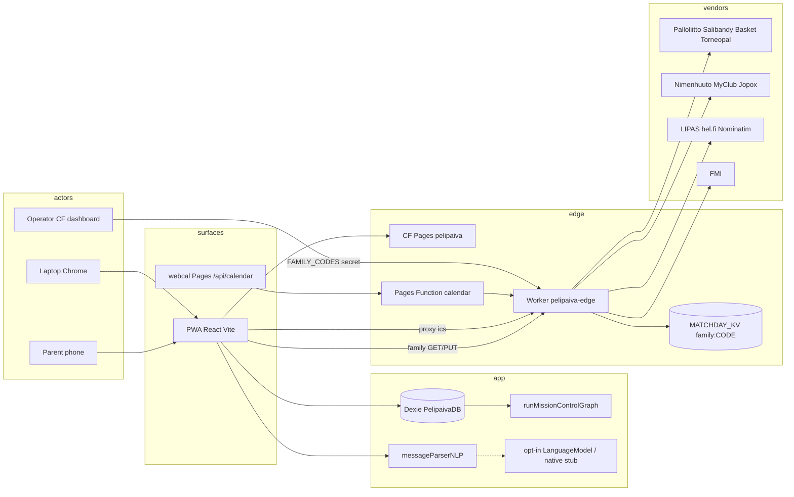

# 03 — System map

## What we know

## Packages

| Unit | Runtime | Role |
|---|---|---|
| `src/` | Browser | Product |
| `cloudflare-worker/` | CF Worker | Proxy + family + ICS merge |
| `functions/api/` | Pages Functions | Calendar host alias |
| `native/ios/` | Unshipped | Core AI bridge stub |

## Env matrix

| Env | Frontend | Worker | FAMILY_CODES |
|---|---|---|---|
| Local | vite :3000 | UNKNOWN unless wrangler dev | empty → 403 |
| Prod | pelipaiva.pages.dev | pelipaiva-edge.sakkoja.workers.dev | dashboard secret |
| Staging | none in repo | none | — |

## What we infer
Single-tenant-per-device, multi-device via issued codes (max ~10).

## What we do not know
Whether `pelipaiva.fi` DNS is live (CORS lists it).
